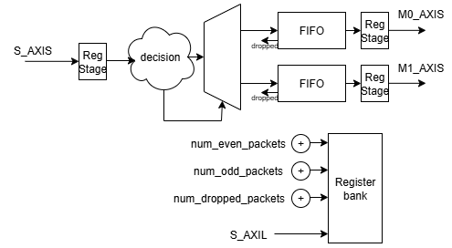
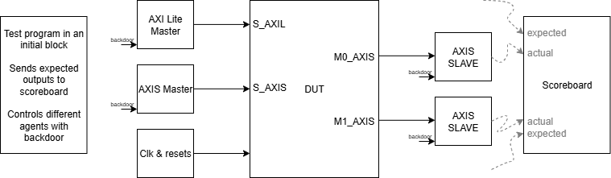

# Packet router

AXIS with two downstream port packet router. It converts a non flow controlled upstream to two flow controlled downstreams. Routing decision based on the header address.

> I don't really understand why we need a drop ability. We could always stall upstream.
> But in the spirit of the question. I assume this is a router just after an ethernet
> port which does not have flow control ability.  
> So this router makes sure no 'incomplete' packets are sent to downstream.

## Parameters

| Name       | Valid values | Description                           |
| --------   | --------     | -----------------------------------   |
| DATA_WIDTH | 32, 64, etc  | Data width of the AXISing buses |
| DEPTH      | any          | Fifo depth                            |

## Interfaces

| Name     | Type     | Description                                    |
| -------- | -------- | -----------------------------------            |
| clk      |          | Clock                                          |
| resetn   |          | Active low asynchronous reset                  |
| s_axis   | AXI ST   | Input packets fully flow controlled with tlast | 
| m0_axis  | AXI ST   | Even packets fully flow controlled with tlast  | 
| m1_axis  | AXI ST   | Odd packets fully flow controlled with tlast   | 
| s_axil   | AXI Lite | AXI Lite to access status registers            |

### AXI ST buses

Packets can consist of any number of AXIS transfers.  
Packets delimited by tlast.  
First 8 byte consist of header where header[7:0] is the address.

Packets with even header address are routed to Even output.  
Packets with odd header address are routed to Odd output.

Packets are dropped when:
- When internal fifo is full.
- packet is invalid (such as those with incomplete headers).

### Status registers

| Address  | Width                        | Type | Description                                                 |
| -------- | --------                     | ---- | -----------------------------------                         |
| 0x0      | Number_even_packets[31:0]    | RO   | Number of packets sent to the even output                   |
| 0x4      | Number_odd_packets[31:0]     | RO   | Number of packets sent to the odd output                    |
| 0x8      | Number_dropped_packets[31:0] | RO   | Number of packets dropped because fifo was full or invalid  |

## Micro architecture

This implements a fully pipelined router where the router processes headers 'inline' with the packet. Therefore, the router does not need to wait for the full header to make a decision.

The advantage of this design is the state machine does not insert any 'bubbles' to upstream or downstream. We can do this because the router only cares about the header to make a decision.

### Decision logic

To manage the header, the decision logic implements a counter to keep track of number of bytes processed.
When processing the first 8 byte (counter == 0), decision logic decides whether to route to Even or Odd downstream.
Counter is reset on the last transfer of a packet.

### Packet drop

To implement packet dropping, a modified AXIS FIFO has been implemneted with an added 'drop' input.

When this 'drop' input is asserted because a packet is invalid, the FIFO shall not send this invalid packet to downstream.  
Similarly, the FIFO drops a packet when it gets full and cannot accept data anymore transfers.

Fifo keeps track of whether a packet was ever dropped with a 'drop_seen' signal. This signal is cleared when the last transfer of a packet is received.

To make sure no 'incomplete' packets are ever sent to downstream, besides implementing the usual read and write pointers, the fifo implements a 'last good write' pointer.
Of course, the empty condition is modified to check the 'last good write' pointer instead of the normal write pointer.

Whenever the FIFO processes the end of a packet, it checks whether 'drop seen' was ever true:
- In the happy case where drop was NOT seen, we move the 'last good write' pointer.
- If drop was seen, we do not move the 'last good write' pointer.

### Register stage

Finally register stages implemented at the upstream s_axis input and the downstream m_axis outputs to isolate valid and ready paths. It is a good idea to do this to allow the packet fifo to be easily integrated with other blocks.

## Verification

### Testbench structure

- **AXI Lite Bus Functional Model** to drive register port.  
  Backdoor access to allow a test to read registers.

- **AXIS master Bus Functional Model** to drive upstream S_AXIS port  
  Backdoor access to allow a test to send packets and control stall behaviour.

- **AXIS slave Bus Functional Model** to accept downstream S_AXIS ports  
  Backdoor access to allow a test to control backpressure behaviour.  
  Slave BFM should forward the packets that it received to a scoreboard to check expectedness and correctness.

- **Scoreboard** to compare DUT output
   > I did not get round to implmeneting that

### Plan

- Verify protocol compliance of S_AXIL input interface.
- Verify protocol compliance of S_AXIS input interface.
- Verify protocol compliance of M0_AXIS output interface.
- Verify protocol compliance of M1_AXIS output interface.
- Verify correct DUT behaviour when S_AXIS stall.
- Verify correct DUT behaviour when M0_AXIS backpressure.
- Verify correct DUT behaviour when M1_AXIS backpressure.
- Verify counter increment on completed packets.
- Invalid packets.

We should implement different test to cover the cases above

> I did not get round to implmeneting that
